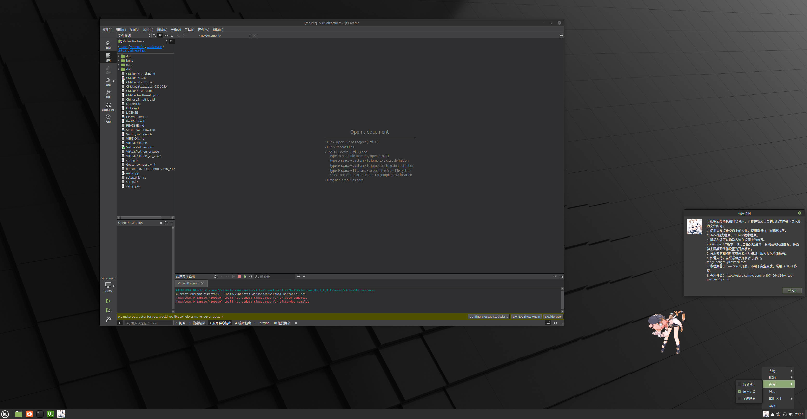

---
title:  "Virtual Partners"
img: paimen.jpeg
categories: ["one", "two"]
date: "2025-03-01T20:49:37+08:00"
draft: false
---

# 基于Qt的AI桌面伙伴
基于Qt6的桌面伴侣，可以在Windows10/11和支持X11的Linux发行版（例如Mint/Ubuntu）上使用。

(音乐和图片素材仅供程序调试使用，不用于任何盈利用途)

# 三种版本
## 版本一：基于PyQt5和PyGame的版本
（提供msi安装包，无内存溢出的风险）：

https://gitee.com/yupengfei1074064684/yuanshen-desktoppet

https://github.com/MrYuPengfei/yuanshen-desktoppet

WindowsNT原神桌面宠物安装向导。附上百度网链接：

通过百度网盘分享的文件：原神桌面宠物V1.7安装向导.exe 链接：https://pan.baidu.com/s/1ZLYbpay6syzQD8Mn4rHM9A?pwd=dey6

## 版本二：基于版本一和Ollama人工智能模型的版本（由于AI服务器到期，目前暂停AI服务）
（建议在Windows11，内存在16GB以上，的电脑上使用，无安装包）：

https://gitee.com/yupengfei1074064684/LlamaVirtualPartners

## 版本三（推荐)：基于Qt6的跨平台版本：
（支持百度千帆大模型，可以在Windows11和Linux Mint Cinnamon Edition 上使用）：

https://gitee.com/yupengfei1074064684/virtual-partners4-pc

https://github.com/MrYuPengfei/VirtualPartners

## Windows11
提供支持windows11的安装向导：

通过网盘分享的文件：原神主题桌面伙伴V2.0.1安装向导.exe 链接: https://pan.baidu.com/s/18anvnHh71icC85X15fQQDQ?pwd=vmu3 提取码: vmu3 --来自百度网盘超级会员v7的分享

## Linux Mint Cinnamon Edition
尚在更新中，暂不提供deb包，目前可现在QtCreater中调试。

# 自定义
可以手动添加你喜欢的动漫角色，将png图片和mp3资源导入安装目录即可。本项目默认提供原神主题，图片和音频来自互联网。